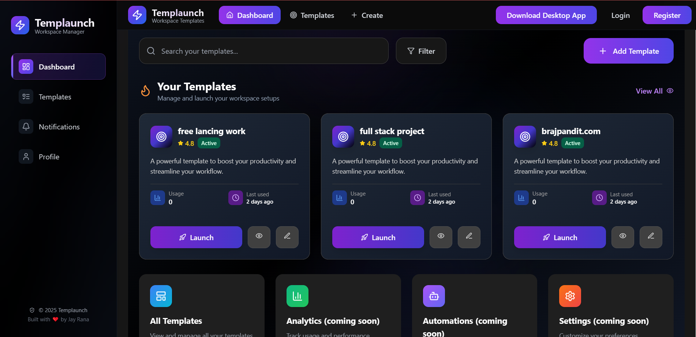

# 🖥️ Templaunch Desktop App 
<div align="center">

****Templaunch** is a productivity-focused desktop application built with **Electron**, **React**, and **TailwindCSS**. It’s designed to help users switch between different work contexts—like Coding, Studying, Meetings, etc.—with ease and efficiency. The app supports extensibility, templating, and will soon be integrated with a powerful backend.**

 [Live Demo : Templaunch Desktop App Download](https://templaunch.vercel.app/)     

</div>
---




## 🔧 Tech Stack

| Layer         | Technologies Used                     |
|---------------|----------------------------------------|
| Frontend      | React, Vite, Tailwind CSS              |
| Desktop Shell | Electron                               |
| Backend       | Node.js (Express / Fastify – Coming Soon) |
| State Mgmt    | React Context API                      |
| Charts        | Recharts                               |
| Authentication| Custom Hooks + Protected Routes        |

---

## 📁 Project Structure
```
├── .gitattributes
├── .github
│   └── workflows
│       └── release.yml
├── backend
│   ├── .env
│   ├── .gitignore
│   ├── app.js
│   ├── config
│   │   └── db.js
│   ├── controllers
│   │   ├── automation.controller.js
│   │   ├── guest.controller.js
│   │   ├── log.controller.js
│   │   ├── setting.controller.js
│   │   ├── template.controller.js
│   │   └── user.controller.js
│   ├── middlewares
│   │   ├── auth.middleware.js
│   │   └── error.middleware.js
│   ├── models
│   │   ├── automation.model.js
│   │   ├── automationLogs.model.js
│   │   ├── preferences.model.js
│   │   ├── template.model.js
│   │   └── user.model.js
│   ├── package-lock.json
│   ├── package.json
│   ├── README.md
│   ├── routes
│   │   ├── admin.routes.js
│   │   ├── automation.routes.js
│   │   ├── guest.route.js
│   │   ├── log.routes.js
│   │   ├── template.routes.js
│   │   └── user.routes.js
│   ├── scheduler
│   │   └── automation.scheduler.js
│   ├── server.js
│   ├── services
│   │   ├── scheduler.service.js
│   │   └── sync.service.js
│   ├── tree.cjs
│   ├── tree.txt
│   └── utils
│       ├── jwt.js
│       ├── launchApps.js
│       ├── launcher.util.js
│       └── logger.js
├── frontend
│   ├── .env
│   ├── .gitignore
│   ├── dist
│   │   ├── assets
│   │   │   ├── index-BLHBy10J.css
│   │   │   └── index-CcCMfaIW.js
│   │   ├── icon.ico
│   │   ├── index.html
│   │   ├── preload.js
│   │   └── vite.svg
│   ├── electron.cjs
│   ├── eslint.config.js
│   ├── index.html
│   ├── package-lock.json
│   ├── package.json
│   ├── preload.js
│   ├── public
│   │   ├── icon.ico
│   │   └── vite.svg
│   ├── README.md
│   ├── src
│   │   ├── App.css
│   │   ├── App.jsx
│   │   ├── assets
│   │   │   ├── app-icon.ico
│   │   │   └── react.svg
│   │   ├── auth
│   │   │   ├── Login.jsx
│   │   │   ├── PrivateRoute.jsx
│   │   │   └── Register.jsx
│   │   ├── components
│   │   │   ├── AutomationForm.jsx
│   │   │   ├── CronHelperModal.jsx
│   │   │   ├── Header.jsx
│   │   │   ├── LogTable.jsx
│   │   │   ├── Sidebar.jsx
│   │   │   ├── ui
│   │   │   │   ├── Button.jsx
│   │   │   │   ├── Card.jsx
│   │   │   │   ├── Input.jsx
│   │   │   │   ├── Modal.jsx
│   │   │   │   ├── Textarea.jsx
│   │   │   │   └── ToggleSwitch.jsx
│   │   │   └── WindowControls.jsx
│   │   ├── context
│   │   │   ├── AuthContext.jsx
│   │   │   └── TemplateContext.jsx
│   │   ├── hooks
│   │   │   ├── useFetchLogs.js
│   │   │   ├── useLocalStorage.js
│   │   │   └── usePreviousAppWebsites.js
│   │   ├── index.css
│   │   ├── main.jsx
│   │   ├── pages
│   │   │   ├── AddTemplate.jsx
│   │   │   ├── admin
│   │   │   │   └── AdminPanel.jsx
│   │   │   ├── Analytics.jsx
│   │   │   ├── AutomationLogs.jsx
│   │   │   ├── Automations.jsx
│   │   │   ├── Dashboard.jsx
│   │   │   ├── EditTemplate.jsx
│   │   │   ├── LaunchHistory.jsx
│   │   │   ├── Logs.jsx
│   │   │   ├── NotFound.jsx
│   │   │   ├── Notifications.jsx
│   │   │   ├── Profile.jsx
│   │   │   ├── ScheduledTemplates.jsx
│   │   │   ├── Settings.jsx
│   │   │   ├── StatCard.jsx
│   │   │   ├── TemplateCard.jsx
│   │   │   ├── TemplateDetail.jsx
│   │   │   └── Templates.jsx
│   │   ├── services
│   │   │   ├── analyticsService.js
│   │   │   ├── api.js
│   │   │   ├── automationService.js
│   │   │   ├── guestApi.js
│   │   │   └── TemplateService.js
│   │   └── utils
│   │       ├── guestTemplates.js
│   │       └── validators.js
│   ├── tailwind.config.js
│   ├── tree.cjs
│   ├── tree.txt
│   └── vite.config.js
├── h origin main --force
├── README.md
└── tree.cjs
```

yaml
Copy
Edit

---

## 🚀 Getting Started

### 1. Clone the Repository

```bash
git clone https://github.com/JaYRaNa213/OneClickOnly_Desktop_APP.git
cd OneClickOnly_Desktop_APP
2. Setup Frontend (Electron + React)
bash
Copy
Edit
cd frontend
npm install

# Start in development mode
npm run dev

# Build for production
npm run build

# Launch the Electron app
npm run start

# Create the Windows installer (.exe)
npm run dist
3. Setup Backend (Coming Soon)
bash
Copy
Edit
cd backend
npm install
npm run dev
📦 Building for Windows
To generate a distributable .exe installer:

bash
Copy
Edit
cd frontend
npm run build
npm run dist
Output:

Production files in: frontend/dist/

Unpacked app in: frontend/dist/win-unpacked/

Installer in: frontend/dist/*.exe

✨ Features
🔐 Secure Authentication with Protected Routes

🧠 Smart Work Templates

💡 AI-Based Context Suggestions (Planned)

🗂️ Workspace Management

🔔 Notification Center

📊 Analytics Dashboard

⚙️ User Settings & Profile

👨‍💻 Author
Jay Rana
GitHub • LinkedIn

📄 License
Licensed under the MIT License © 2025 — Jay Rana

yaml
Copy
Edit

---

Let me know if you'd like:
- A live preview badge
- GitHub Actions CI status badges
- Screenshots or GIFs added
- Auto-update section for users

Would you like me to include `.exe` download links or usage instructions too?


