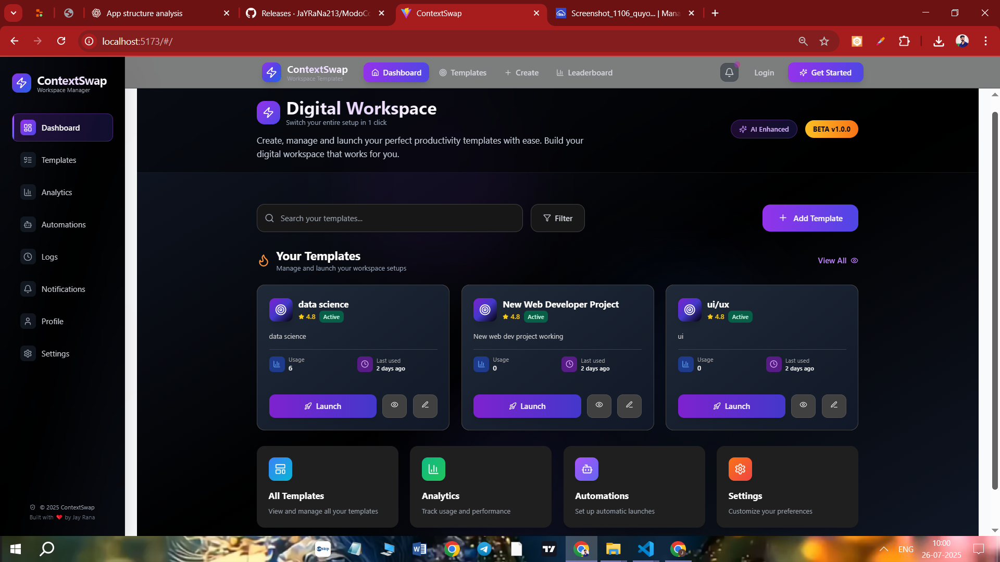

# 🖥️ ContextSwap Desktop App 
<div align="center">

****ContextSwap** is a productivity-focused desktop application built with **Electron**, **React**, and **TailwindCSS**. It’s designed to help users switch between different work contexts—like Coding, Studying, Meetings, etc.—with ease and efficiency. The app supports extensibility, templating, and will soon be integrated with a powerful backend.**

 [Live Demo : ContextSwap Desktop App Download](https://contextswap-8lun.onrender.com/)     

</div>
---




## 🔧 Tech Stack

| Layer         | Technologies Used                     |
|---------------|----------------------------------------|
| Frontend      | React, Vite, Tailwind CSS              |
| Desktop Shell | Electron                               |
| Backend       | Node.js (Express / Fastify – Coming Soon) |
| State Mgmt    | React Context API                      |
| Charts        | Recharts                               |
| Authentication| Custom Hooks + Protected Routes        |

---

## 📁 Project Structure

context_p/
├── frontend/ # Electron + Vite + React (Main App)
│ ├── src/ # React source code
│ ├── dist/ # Production build output
│ └── public/ # Static assets like icon.ico
├── backend/ # (Coming Soon) Node.js/Express API

yaml
Copy
Edit

---

## 🚀 Getting Started

### 1. Clone the Repository

```bash
git clone https://github.com/JaYRaNa213/OneClickOnly_Desktop_APP.git
cd OneClickOnly_Desktop_APP
2. Setup Frontend (Electron + React)
bash
Copy
Edit
cd frontend
npm install

# Start in development mode
npm run dev

# Build for production
npm run build

# Launch the Electron app
npm run start

# Create the Windows installer (.exe)
npm run dist
3. Setup Backend (Coming Soon)
bash
Copy
Edit
cd backend
npm install
npm run dev
📦 Building for Windows
To generate a distributable .exe installer:

bash
Copy
Edit
cd frontend
npm run build
npm run dist
Output:

Production files in: frontend/dist/

Unpacked app in: frontend/dist/win-unpacked/

Installer in: frontend/dist/*.exe

✨ Features
🔐 Secure Authentication with Protected Routes

🧠 Smart Work Templates

💡 AI-Based Context Suggestions (Planned)

🗂️ Workspace Management

🔔 Notification Center

📊 Analytics Dashboard

⚙️ User Settings & Profile

👨‍💻 Author
Jay Rana
GitHub • LinkedIn

📄 License
Licensed under the MIT License © 2025 — Jay Rana

yaml
Copy
Edit

---

Let me know if you'd like:
- A live preview badge
- GitHub Actions CI status badges
- Screenshots or GIFs added
- Auto-update section for users

Would you like me to include `.exe` download links or usage instructions too?


Ask ChatGPT


